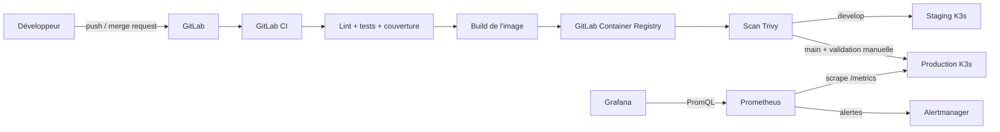

# Factory API — projet fil rouge Usine Logicielle

Ce dépôt livre une chaîne DevOps complète, du commit Git au service supervisé dans K3s. Il répond à la fiche projet `projet.md` de ClassLab avec une application témoin simple afin que la démonstration porte sur l'usine logicielle.

## Résultat livré

- API FastAPI et page web, documentation OpenAPI sur `/docs` ;
- tests automatisés avec seuil de couverture de 90 % ;
- image Docker multi-stage, utilisateur non privilégié et système de fichiers en lecture seule ;
- pipeline GitLab CI : validation, tests, build, publication, scan Trivy et déploiement ;
- overlays Kubernetes `staging` et `production` avec Kustomize ;
- probes, rolling update sans indisponibilité, limites de ressources, HPA et NetworkPolicy ;
- métriques Prometheus, règles d'alerte et dashboard Grafana provisionné ;
- documentation d'architecture, procédure d'exploitation, scénario de démonstration et support oral.

## Architecture



Le détail et les décisions sont dans [docs/architecture.md](docs/architecture.md).

## Démarrage local

### Avec Python

```bash
make install
make test
make lint
make run
```

Puis ouvrir <http://127.0.0.1:8000> et <http://127.0.0.1:8000/docs>.

### Avec Docker Compose

```bash
docker compose up --build -d
make stack-test
```

Cette commande lance la pile locale complète :

| Service | Adresse | Accès |
|---|---|---|
| Factory API | <http://localhost:8000> | public |
| Documentation OpenAPI | <http://localhost:8000/docs> | public |
| Prometheus | <http://localhost:9090> | public dans le lab |
| Grafana | <http://localhost:3000> | `admin` / `classlab` par défaut |

Le dashboard « Factory API » et la source Prometheus sont provisionnés automatiquement. Utiliser un fichier `.env` dérivé de `.env.example` pour changer les identifiants Grafana. Pour arrêter la pile sans supprimer les données :

```bash
docker compose stop
```

## Déploiement K3s

Le cluster ClassLab doit être disponible depuis VM1 ou le poste local :

```bash
kubectl get nodes
kubectl apply -k k8s/overlays/production
kubectl -n factory rollout status deployment/factory-api
kubectl -n factory get deployment,pods,service,ingress,hpa
```

Sans registre, charger d'abord une image locale sur les nœuds K3s ou remplacer `factory-api:latest` dans le manifeste. Dans GitLab CI, le pipeline remplace automatiquement ce nom par l'image immuable associée au SHA du commit.

L'application de production répond sur <http://factory.192.168.56.12.nip.io> dans le namespace `factory`. L'overlay de staging utilise <http://factory-staging.192.168.56.12.nip.io> dans le namespace indépendant `factory-staging`.

## Supervision

Le démarrage Docker Compose précédent fournit déjà Prometheus et Grafana pour la démonstration locale. Pour la cible K3s, installer les charts compatibles avec les versions proposées dans ClassLab :

```bash
helm repo add prometheus-community https://prometheus-community.github.io/helm-charts
helm repo add grafana https://grafana.github.io/helm-charts
helm repo update
kubectl create namespace monitoring --dry-run=client -o yaml | kubectl apply -f -
helm upgrade --install prometheus prometheus-community/prometheus \
  --version 27.30.0 --namespace monitoring \
  -f monitoring/values-prometheus.yaml
helm upgrade --install grafana grafana/grafana \
  --version 9.3.2 --namespace monitoring \
  -f monitoring/values-grafana.yaml
kubectl apply -f monitoring/grafana-dashboard.yaml
```

Le dashboard « Factory API » présente le débit, le taux d'erreurs, la latence p95 et le trafic par statut HTTP. Prometheus déclenche une alerte si l'application reste indisponible deux minutes ou si plus de 5 % des requêtes échouent pendant cinq minutes.

## Configuration GitLab

1. Créer un projet GitLab vide et y pousser le contenu de ce dossier.
2. Activer le Container Registry.
3. Créer un agent Kubernetes nommé `k3s`, puis adapter le projet autorisé dans `.gitlab/agents/k3s/config.yaml`.
4. Installer l'agent dans K3s avec la commande fournie par GitLab.
5. Définir la variable CI/CD protégée `KUBE_CONTEXT` avec la valeur `<groupe>/<projet>:k3s`.
6. Pousser sur `develop` pour déployer le staging. Fusionner vers `main`, puis valider manuellement le job production.

Les variables `CI_REGISTRY_*` et `CI_COMMIT_SHA` sont fournies automatiquement par GitLab. Aucun kubeconfig ni mot de passe n'est stocké dans Git.

## Démonstration

Le déroulé chronométré se trouve dans [docs/demo.md](docs/demo.md). Une fois le déploiement terminé :

```bash
./scripts/demo.sh
```

## Livrables

- documentation technique : ce README et le dossier `docs/` ;
- schéma d'architecture : [docs/architecture.md](docs/architecture.md) ;
- support de présentation : `presentation/Usine_Logicielle_ClassLab.pptx` ;
- notes orales : [presentation/notes-orales.md](presentation/notes-orales.md) ;
- dépôt Git : ce dossier est prêt à être publié dans votre espace GitLab.

## Limites

- la publication et l'exécution du pipeline nécessitent un projet GitLab et un agent connecté au cluster ;
- les certificats TLS et un nom DNS d'entreprise ne sont pas configurés dans ce lab local ;
- l'application témoin ne stocke aucune donnée, donc sauvegarde et migration de base ne font pas partie du périmètre ;
- le HPA dépend de Metrics Server, installé par défaut avec K3s ;
- le `NetworkPolicy` dépend du contrôleur réseau actif dans le cluster.
