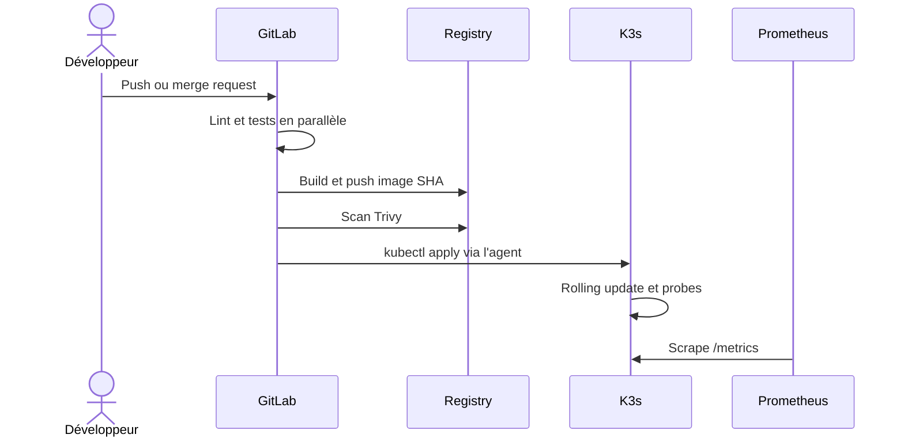

# Architecture et choix techniques

## Contexte

L'équipe part d'un cycle manuel : builds irréguliers, tests facultatifs, environnements divergents, faible traçabilité des images et peu de supervision. Le projet met en place une chaîne reproductible où le commit devient l'unité de traçabilité.

## Chaîne de livraison

| Étape | Outil | Preuve produite |
|---|---|---|
| Source et revue | GitLab | historique, merge request, SHA du commit |
| Qualité | Ruff, pytest, coverage | rapport JUnit et couverture Cobertura |
| Construction | Docker | image OCI marquée avec le SHA |
| Sécurité | Trivy | rapport GitLab Container Scanning, blocage sur HIGH/CRITICAL corrigible |
| Livraison | GitLab Container Registry | image immuable `$CI_REGISTRY_IMAGE:$CI_COMMIT_SHA` |
| Déploiement | GitLab Agent, kubectl, Kustomize | rollout contrôlé, staging automatique, production manuelle |
| Exploitation | Prometheus, Alertmanager, Grafana | métriques, alertes, dashboard versionné |

## Flux d'exécution



## Décisions

**FastAPI.** L'application expose rapidement une API documentée, deux health checks et des métriques. Elle reste volontairement petite pour rendre le pipeline observable pendant une démonstration.

**Image immuable par SHA.** Un tag de commit permet de retrouver exactement le code livré. `latest` reste un alias pratique, mais le déploiement CI utilise le SHA.

**Kustomize.** La base centralise la configuration commune. Les overlays ne décrivent que les écarts entre staging et production. Le staging utilise `factory-staging` et la production `factory`, ce qui empêche un déploiement de remplacer l'autre.

**GitLab Agent.** Le cluster initie une connexion sortante vers GitLab. Le pipeline sélectionne un contexte autorisé sans enregistrer un kubeconfig administrateur dans les variables CI.

**Déploiement progressif.** La production utilise deux replicas et peut monter à cinq. Le staging démarre avec un replica et peut monter à trois. `maxUnavailable: 0`, les probes et l'attente du rollout empêchent GitLab d'annoncer un succès avant la disponibilité du nouveau ReplicaSet.

**Défense en profondeur.** Le conteneur tourne avec l'UID 10001, sans privilèges, sans capabilities, avec un système de fichiers en lecture seule et sans jeton Kubernetes automatique. Les ressources sont bornées et le trafic entrant est limité aux namespaces Traefik et monitoring.

## Composants dans K3s

```text
Internet / poste de démonstration
              |
         Traefik Ingress
              |
       Service factory-api
          /          \
      Pod API      Pod API       <- HPA 2 à 5 replicas
          \          /
             /metrics
                |
            Prometheus ---- Alertmanager
                |
              Grafana
```

## Disponibilité et retour arrière

Kubernetes conserve trois ReplicaSets. Si la validation après déploiement échoue :

```bash
kubectl -n factory rollout history deployment/factory-api
kubectl -n factory rollout undo deployment/factory-api
kubectl -n factory rollout status deployment/factory-api
```

Le rollback restaure le template du ReplicaSet précédent. L'absence de stockage applicatif évite un problème de compatibilité de schéma dans cette démonstration.

## Risques résiduels

Le lab utilise HTTP et `nip.io`, sans certificat TLS. Un contexte réel ajouterait cert-manager, un gestionnaire de secrets externe, une politique de sauvegarde, une analyse SAST et une stratégie de promotion d'image signée entre environnements.
